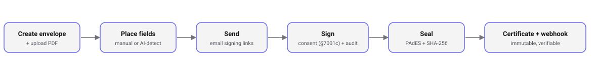

<div align="center">

# Penpact

**The open-source e-signature API for developers. Embed legally-binding electronic signatures in your own product, self-hosted or in the cloud. An open DocuSign alternative.**

Point it at any PDF, place fields by hand or with AI, drop a themeable signing flow into your app, and get back a sealed PDF with an audit trail and a Certificate of Completion. Usage-based pricing, no per-seat or per-page billing.

[](LICENSE)
[](#status)
[](#)

[Website](https://penpact.dev) · [Docs](https://penpact.dev/e-signature-api) · [Blog](https://penpact.dev/blog) · [Pricing](https://penpact.dev/pricing) · [Compare](https://penpact.dev/open-source-docusign-alternative)

</div>

<p align="center"></p>

---

> **Status: early development (v0.1.0).** The signing engine is built and works end to end, but the API is not yet stable, the consent text is pending legal review, and the default PAdES certificate is self-signed unless you supply your own. Stars, issues, and pull requests are welcome.

## What is Penpact?

Penpact is an open-source e-signature engine you embed in your own product instead of sending users to a separate signing app. Your backend creates an envelope (a document plus its signers), uploads a PDF, places the fields each signer must fill, and sends it. Signers consent and sign inside your app under your brand, and Penpact returns a sealed, tamper-evident PDF with an append-only audit trail and a Certificate of Completion. Self-host the whole stack under AGPL-3.0, or use the managed cloud.

If you are a developer adding signing to a SaaS, Penpact is built for exactly that. If you need a finished standalone signing app or EU qualified signatures (QES) today, a more mature vendor may fit better. We say so plainly.

## Features

- **In-document signing.** Signers fill fields placed right on the document, with a guided "next field" flow that walks them through every required spot. Works on a hosted page or a drop-in, themeable React component, all under your brand. Long contracts render page by page as the signer scrolls, so a 600-page PDF opens as fast as a one-pager.
- **AI field detection.** Point Claude, Gemini, or GPT at a PDF and it proposes signature, name, and date fields for you to adjust. Falls back to no proposals when no provider key is set.
- **Typed SDK, not a generated blob.** A small, hand-written `@penpact/sdk` (TypeScript) you can read in one sitting, plus generated clients for Python, Go, and PHP.
- **Evidence built in.** Electronic-records consent (US ESIGN Act), an append-only audit trail with IP and timestamps, a SHA-256 hash, a PAdES digital signature on the sealed PDF, and a Certificate of Completion.
- **Real workflow.** Templates with variable merge, bulk send via CSV, automated reminders, conditional fields, eleven field types (including file attachments a signer uploads into the sealed packet), signer delegation, sequential routing, and signer authentication (access code or email OTP).
- **Teams and webhooks.** Organizations with shared workspaces, plus a durable, HMAC-signed webhook queue.
- **White-label, free.** Your logo and brand color apply on every tier, including self-host and the free cloud.
- **No per-seat billing.** Usage-based on the cloud, free forever when you self-host. Signing is a feature of your product, not a per-user tax.

## Quickstart

```ts
import { PenpactClient } from '@penpact/sdk';

const penpact = new PenpactClient({ apiKey: process.env.PENPACT_API_KEY! });

const envelope = await penpact.createEnvelope({
  documentName: 'Mutual NDA',
  signers: [{ name: 'Ada Lovelace', email: 'ada@example.com' }],
});

await penpact.uploadDocument(envelope.id, pdfBytes);
await penpact.placeFields(envelope.id, [
  { type: 'signature', signerId: envelope.signers[0].id, page: 1, x: 72, y: 620, width: 200, height: 40 },
]);

// Your signer gets a link, consents, and signs.
// You get back a sealed, PAdES-signed PDF and a certificate.
await penpact.send(envelope.id);
```

### Self-host in minutes

One click (each provisions Postgres and the API from this repo):

[](https://railway.app/new/template?template=https://github.com/penpact/penpact)
[](https://render.com/deploy?repo=https://github.com/penpact/penpact)

…or with Docker:

```bash
docker compose up
```

This brings up Postgres and the API, applies migrations, and prints a ready-to-use demo API key in the logs. Then point the SDK at `http://localhost:3000`:

```ts
const penpact = new PenpactClient({ apiKey: 'pk_live_…', baseUrl: 'http://localhost:3000' });
```

Mint more keys with `docker compose exec api node apps/api/dist/bin/bootstrap.js you@example.com`. To enable AI field detection when self-hosting, set `ANTHROPIC_API_KEY`, `GEMINI_API_KEY`, or `OPENAI_API_KEY`.

## How Penpact compares

| | Penpact | DocuSign API | DocuSeal | Documenso | OpenSign |
|---|---|---|---|---|---|
| Open source | ✅ AGPL-3.0 | ❌ | ✅ AGPL-3.0 | ✅ AGPL-3.0 | ✅ AGPL-3.0 |
| API-first, embeddable | ✅ | ⚠️ iframe | ⚠️ app-first | ✅ | ⚠️ app-first |
| Typed TypeScript SDK | ✅ | ⚠️ generated | ⚠️ | ✅ | ⚠️ |
| AI field detection | ✅ | ⚠️ add-on | ❌ | ❌ | ❌ |
| White-label in open core | ✅ | ❌ | ⚠️ paid | ⚠️ platform tier | ✅ |
| Pricing model | usage-based, no seats | per-envelope + seats | per-user + per-completion | tiered | self-host / SaaS |

Read the detailed comparisons: [vs DocuSign](https://penpact.dev/penpact-vs-docusign) · [vs DocuSeal](https://penpact.dev/penpact-vs-docuseal) · [vs Documenso](https://penpact.dev/penpact-vs-documenso) · [vs OpenSign](https://penpact.dev/penpact-vs-opensign). Comparisons reflect public positioning as of 2026; verify current vendor details before relying on them.

## Who is Penpact for?

Reach for Penpact when you want to:

- Add e-signatures to your own app or SaaS through an API and SDK.
- Self-host an open-source, embeddable DocuSign alternative.
- Keep signers inside your product under your own brand.
- Pay for signing by usage, with no per-seat fees.
- Place signature fields on contracts with AI instead of by hand.

## FAQ

**Is Penpact a free DocuSign alternative?**
Yes. The core engine is open source under AGPL-3.0, so you can self-host it for free and read the source. The managed cloud is usage-based with no per-seat billing, and embedding plus brand theming are free on every tier.

**Are signatures collected through Penpact legally binding?**
Penpact captures the four elements courts look for: intent, electronic-records consent under the US ESIGN Act, attribution by email and IP, and integrity via a SHA-256 hash plus a PAdES digital signature. It targets simple electronic signatures (SES) under US ESIGN, UETA, and EU eIDAS. It does not yet support EU qualified signatures (QES).

**Can I self-host Penpact?**
Yes. `docker compose up` starts Postgres and the API and prints a working API key, so the first signed document takes minutes. Every document stays on your own infrastructure, under AGPL-3.0.

**Which languages have an SDK?**
TypeScript is first-class (`@penpact/sdk`). Generated clients for Python, Go, and PHP are produced from the OpenAPI spec in `docs/openapi.yaml`.

## Repository layout

This is a pnpm + TypeScript monorepo.

```
apps/
  api/          Hono REST API + signing engine (the open core)
  marketing/    Astro marketing + SEO site (penpact.dev)
packages/
  core/         Shared domain model + compliance vocabulary (audit events, statuses)
  db/           Drizzle schema + Postgres client
  sdk/          @penpact/sdk, the official typed client
clients/        Generated SDKs (Python, Go, PHP) from the OpenAPI spec
docs/           OpenAPI spec, assets, and plans
```

## Development

```bash
pnpm install
pnpm check        # Biome lint + format check
pnpm typecheck    # tsc project references
pnpm test         # Vitest (unit; integration suites run with DATABASE_URL set)
pnpm --filter @penpact/api dev   # run the API locally
```

## Roadmap

1. **Core signing engine** (done) — envelopes, fields, consent, append-only audit log, SHA-256 + PAdES seal, Certificate of Completion.
2. **Developer DX** (done) — typed TypeScript SDK, embeddable React signing component, visual field builder, sub-15-minute quickstart.
3. **AI field detection** (done) — automatic field placement with Claude, Gemini, or GPT.
4. **Workflow** (done) — templates, bulk send, reminders, conditional fields, teams, webhooks, signer auth, i18n.
5. **Compliance hardening** (in progress) — legal review of consent text, a trusted/AATL signing certificate, an AES/QES path.
6. **Cloud + billing** (next) — Stripe usage metering on top of the existing plan and quota model.

## Why AGPL-3.0

The core is AGPL so anyone can self-host, but a company cannot ship our code inside a closed competing product without open-sourcing theirs. Self-hosters are welcome and become word of mouth; companies that prefer not to run infrastructure use the managed cloud. A separate commercial license is available for embedding the engine in a closed-source product; see [`SECURITY.md`](SECURITY.md) for contact.

## Contributing

See [`CONTRIBUTING.md`](CONTRIBUTING.md). For security issues, please follow [`SECURITY.md`](SECURITY.md).

## License

[AGPL-3.0-only](LICENSE) © Penpact
